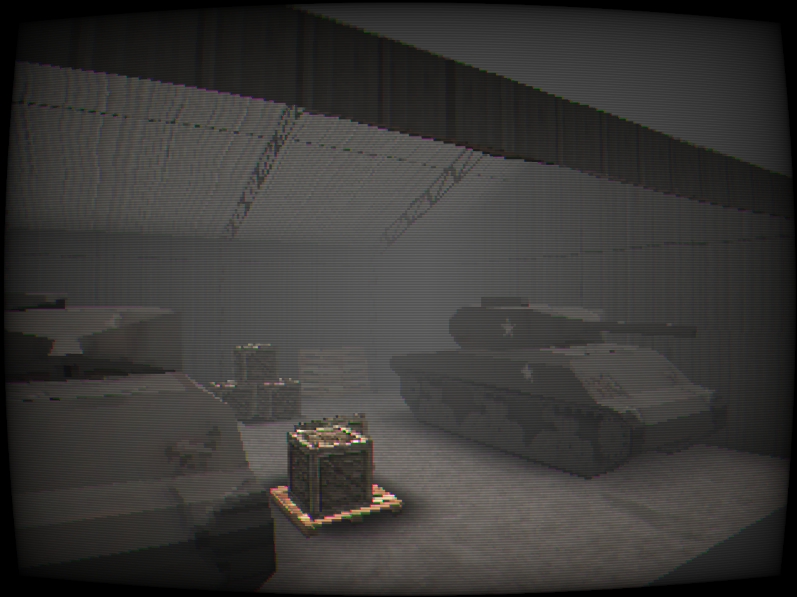

# Polybox

Polybox is an in-development PS1 era fantasy console, a bit like Pico-8, but with simple 3D as well as 2D.



It's still rather primitive and early in development, mostly it's just a dedicated PS1 renderer right now with an old fashioned fix function pipeline. You render objects like this:

```lua
function Update(deltaTime)
    MatrixMode("Projection")
    Identity()
    Perspective(320, 240, 1, 20, 60)

    MatrixMode("View")
    Identity()
    Translate(-1.5, -1.5, -2)

    BeginObject3D("Triangles")
        Color(1.0, 0.0, 0.0, 1.0)
        Vertex(1.0, 1.0, 0.0)

        Color(0, 1, 0, 1)
        Vertex(1, 2, 0)

        Color(0, 0, 1, 1)
        Vertex(2.0, 2.0, 0.0)
    EndObject3D()
end
```

The above gives you the following output:


# Current features

- PS1 era fixed-function 3D rendering
- Special shaders for emulating PS1 era look
- Basic flat and smooth shaded lighting
- Gltf model loading
- 2D sprite drawing
- Depth cueing fog
- Simple 2D shape drawing
- Lua VM for running your game code
- Input system that emulates a PS1 like controller

# Planned features

- Audio
- A development environment for making games with the console
- Development tools such as level editors made in the lua development environment
- Some sample games

# Supported platforms

Currently only Windows 64 bit. It shouldn't be that hard to port to other platforms though, as it uses bgfx for rendering and SDL for platform stuff. But it's early enough I have no interest in porting and testing on other platforms.

# Documentation

Also too early for this, but the codebase is extremely simple and hopefully self documenting. The main API that is of interest is the GraphicsChip.h file. The entire rendering API is contained there in a very small amount of code, so small I can list it here,

```cpp
void Init();
void DrawFrame(float w, float h);

// Basic draw 2D
void DrawSprite(const char* spritePath, float x, float y);

// Basic draw 3D
void BeginObject3D(EPrimitiveType type);
void EndObject3D();
void Vertex(Vec3f vec);
void Color(Vec4f col);
void TexCoord(Vec2f tex);
void Normal(Vec3f norm);

void SetClearColor(Vec3f color);

// Transforms
void MatrixMode(EMatrixMode mode);
void Perspective(float screenWidth, float screenHeight, float nearPlane, float farPlane, float fov);
void Translate(Vec3f translation);
void Rotate(Vec3f rotation);
void Scale(Vec3f scaling);
void Identity();

// Texturing
// ENable/Disable texturing
void BindTexture(const char* texturePath);
void UnbindTexture();

// Lighting
void NormalsMode(ENormalsMode mode);
void EnableLighting(bool enabled);
void Light(int id, Vec3f direction, Vec3f color);
void Ambient(Vec3f color);

// Depth Cueing
void EnableFog(bool enabled);
void SetFogStart(float start);
void SetFogEnd(float end);
void SetFogColor(Vec3f color);
```


# Compiling

The project uses premake5, which is packaged alongside the project, as well as all the dependencies you'll need. You simple run premake5.exe vs2019 (or another project type) and you'll get your project you can compile with
